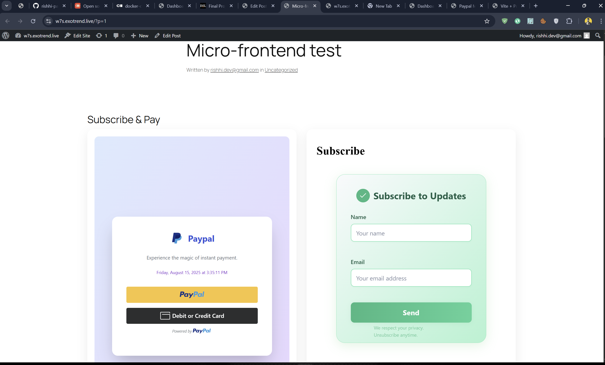

# WordPress + OpenTelemetry (OTEL) — Docker Compose Stack

A reproducible WordPress stack with:

- **PHP 8.3 (Alpine)** running the built-in server
- **MySQL 9.4** (pinned) with health checks
- **OpenTelemetry PHP extension** (HTTP/Protobuf OTLP exporter)
- Reverse-proxy–friendly configuration (works with Codespaces or your own domain)
- Easy **micro-frontend embeds** for two external apps: `p4l.exotrend.live` and `s8r.exotrend.live`

## [w7s.exotrend.live](https://w7s.exotrend.live/) [Embed micro-frontends (P4L & S8R)]



---

## Table of contents

1. [Prerequisites](#prerequisites)
2. [Project layout](#project-layout)
3. [Configuration](#configuration)
4. [Quick start](#quick-start)
5. [OpenTelemetry](#opentelemetry)
6. [Install WordPress via browser or WP‑CLI](#install-wordpress-via-browser-or-wp-cli)
7. [Embed micro-frontends (P4L &amp; S8R)](#embed-micro-frontends-p4l--s8r)
8. [Reverse proxy hints (domain + HTTPS)](#reverse-proxy-hints-domain--https)
9. [Troubleshooting](#troubleshooting)
10. [Useful commands](#useful-commands)

---

## Prerequisites

- Docker (24+) and Docker Compose plugin.
- A public domain (optional) and reverse proxy if you want HTTPS on the outside (examples below).
- If using GitHub Codespaces, use your forwarded URL or your own domain that proxies to the forwarded port.

---

## Project layout

```
.
├── Dockerfile
├── docker-compose.yml
├── start_wordpress.sh
├── wp-config.php
└── otel.php.ini
```

### `docker-compose.yml` (reference)

```yaml
services:
  db:
    image: mysql:9.4
    environment:
      MYSQL_ROOT_PASSWORD: example
      MYSQL_USER: wordpress
      MYSQL_PASSWORD: Secret5555
      MYSQL_DATABASE: wordpress
    volumes:
      - my-datavolume:/var/lib/mysql
    healthcheck:
      test: ["CMD-SHELL", "mysqladmin ping -h 127.0.0.1 -pexample || exit 1"]
      interval: 5s
      timeout: 3s
      retries: 30
      start_period: 40s
    restart: unless-stopped

  wordpress:
    build: .
    user: "www-data:www-data"
    depends_on:
      db:
        condition: service_healthy
    ports:
      - "8086:8080" # container listens on 8080; host exposes 8086
    environment:
      # --- WordPress DB config ---
      DB_HOST: db
      DB_NAME: wordpress
      DB_USER: wordpress
      DB_PASSWORD: Secret5555

      # --- Public base URL (pick one) ---
      # If using a custom domain/proxy:
      WP_HOME: https://w7s.exotrend.live
      WP_SITEURL: https://w7s.exotrend.live
      # Or, for local access:
      # WP_HOME: http://localhost:8086
      # WP_SITEURL: http://localhost:8086

      # --- OpenTelemetry ---
      OTEL_SERVICE_NAME: wordpress-otel
      OTEL_TRACES_EXPORTER: otlp
      OTEL_EXPORTER_OTLP_PROTOCOL: http/protobuf
      OTEL_EXPORTER_OTLP_TRACES_ENDPOINT: https://otel.exotrend.live/v1/traces
      OTEL_PROPAGATORS: baggage,tracecontext
      OTEL_RESOURCE_ATTRIBUTES: service.namespace=wordpress,deployment.environment=local

    volumes:
      - my-contentvolume:/var/local/wordpress/wp-content
    restart: unless-stopped

volumes:
  my-datavolume:
  my-contentvolume:
```

### `Dockerfile` (reference)

```dockerfile
FROM php:8.3.6-cli-alpine3.19

# Build & runtime deps (PECL, tools, DB client)
RUN apk add --no-cache $PHPIZE_DEPS curl wget unzip bash mariadb-client tar

# OpenTelemetry extension (PECL) + enable
RUN pecl install opentelemetry && docker-php-ext-enable opentelemetry

# Common PHP extensions for WP
RUN docker-php-ext-install mysqli pdo pdo_mysql

# Fetch & stage WordPress
RUN curl -fsSL https://wordpress.org/latest.zip -o /tmp/wordpress.zip \
 && unzip -q /tmp/wordpress.zip -d /var/local \
 && mkdir -p /var/local/wordpress/wp-content \
 && chown -R www-data:www-data /var/local/wordpress

# App files
COPY --chown=www-data:www-data ./wp-config.php /var/local/wordpress/wp-config.php
COPY --chown=www-data:www-data ./start_wordpress.sh /usr/local/bin/start_wordpress.sh
COPY ./otel.php.ini /usr/local/etc/php/conf.d/otel.ini

USER root
RUN chmod +x /usr/local/bin/start_wordpress.sh
USER www-data

WORKDIR /var/local/wordpress
VOLUME ["/var/local/wordpress/wp-content"]

EXPOSE 8080
CMD ["/usr/local/bin/start_wordpress.sh"]
```

### `start_wordpress.sh` (PHP `mysqli` wait — robust for MySQL 8/9)

```sh
#!/bin/sh
set -e

: "${DB_HOST:?Set DB_HOST}"
: "${DB_USER:?Set DB_USER}"
: "${DB_PASSWORD:?Set DB_PASSWORD}"
: "${DB_NAME:=wordpress}"

echo "⏳ waiting for DB at ${DB_HOST} as ${DB_USER}..."
php -d auto_prepend_file= -r '
$h=getenv("DB_HOST"); $u=getenv("DB_USER"); $p=getenv("DB_PASSWORD"); $d=getenv("DB_NAME");
$timeout=120; $start=time();
do {
  $m=@mysqli_init();
  @mysqli_options($m, MYSQLI_OPT_CONNECT_TIMEOUT, 5);
  @$m->real_connect($h,$u,$p,$d,3306);
  if (mysqli_connect_errno()) { fwrite(STDERR, "waiting: ".mysqli_connect_error()."\n"); sleep(2); }
} while (mysqli_connect_errno() && (time()-$start)<$timeout);
if (mysqli_connect_errno()) { fwrite(STDERR,"❌ DB still unreachable\n"); exit(1); }
'
echo "✅ DB reachable. Starting PHP server on :8080"
exec php -d auto_prepend_file= -S 0.0.0.0:8080 -t /var/local/wordpress
```

### `wp-config.php` (proxy-aware + env-driven)

```php
<?php
define('DB_NAME',     getenv('DB_NAME')     ?: 'wordpress');
define('DB_USER',     getenv('DB_USER')     ?: 'wordpress');
define('DB_PASSWORD', getenv('DB_PASSWORD') ?: 'Secret5555');
define('DB_HOST',     getenv('DB_HOST')     ?: 'db');
define('DB_CHARSET',  'utf8');
define('DB_COLLATE',  '');

/* Replace the salts for production: https://api.wordpress.org/secret-key/1.1/salt/ */
define('AUTH_KEY',         'change-this-key');
define('SECURE_AUTH_KEY',  'change-this-key');
define('LOGGED_IN_KEY',    'change-this-key');
define('NONCE_KEY',        'change-this-key');
define('AUTH_SALT',        'change-this-key');
define('SECURE_AUTH_SALT', 'change-this-key');
define('LOGGED_IN_SALT',   'change-this-key');
define('NONCE_SALT',       'change-this-key');

$table_prefix = 'wp_';
define('WP_DEBUG', false);

/* Normalize reverse-proxy headers (Codespaces/Cloudflare/Nginx) */
if (!empty($_SERVER['HTTP_X_FORWARDED_HOST'])) {
  $_SERVER['HTTP_HOST'] = $_SERVER['HTTP_X_FORWARDED_HOST'];
}
if (!empty($_SERVER['HTTP_X_FORWARDED_PROTO'])) {
  $_SERVER['HTTPS'] = $_SERVER['HTTP_X_FORWARDED_PROTO'] === 'https' ? 'on' : '';
}

/* Force public base URL (comes from env) */
$__home    = getenv('WP_HOME')    ?: 'http://localhost:8086';
$__siteurl = getenv('WP_SITEURL') ?: $__home;
define('WP_HOME',    $__home);
define('WP_SITEURL', $__siteurl);

/* Optional: absolute content URL to avoid relative path issues */
if (!defined('WP_CONTENT_URL')) {
  define('WP_CONTENT_URL', rtrim(WP_HOME, '/').'/wp-content');
}

/* Direct FS writes inside container */
define('FS_METHOD', 'direct');

if (!defined('ABSPATH')) define('ABSPATH', __DIR__ . '/');
require_once ABSPATH . 'wp-settings.php';
```

### `otel.php.ini` (minimal, safe)

```ini
[opentelemetry]
extension=opentelemetry.so
; DO NOT set auto_prepend_file here.
; DO NOT enable protobuf.so unless actually installed.
```

---

## Configuration

| Key                                  | Purpose                                 | Default                                |
| ------------------------------------ | --------------------------------------- | -------------------------------------- |
| `DB_HOST`                            | MySQL hostname                          | `db`                                   |
| `DB_NAME`                            | WordPress database name                 | `wordpress`                            |
| `DB_USER`                            | WordPress DB user                       | `wordpress`                            |
| `DB_PASSWORD`                        | WordPress DB password                   | `Secret5555`                           |
| `WP_HOME`, `WP_SITEURL`              | Public site URL (domain or proxy)       | `http://localhost:8086`                |
| `OTEL_SERVICE_NAME`                  | Service name in APM                     | `wordpress-otel`                       |
| `OTEL_EXPORTER_OTLP_TRACES_ENDPOINT` | OTLP HTTP endpoint**with `/v1/traces`** | `https://otel.exotrend.live/v1/traces` |

---

## Quick start

```bash
# 1) Build and run
docker compose up -d --build

# 2) Check status
docker compose ps

# 3) Open your site
# - http://localhost:8086     (local)
# - https://w7s.exotrend.live  (if you proxy your domain to 8086)
```

If you see a redirect to the wrong host, set `WP_HOME`/`WP_SITEURL` appropriately and re-`up -d`.

---

## OpenTelemetry

This stack loads the **OpenTelemetry PHP extension** and sends traces via **OTLP HTTP/Protobuf**.

Environment ensures:

```
OTEL_SERVICE_NAME=wordpress-otel
OTEL_TRACES_EXPORTER=otlp
OTEL_EXPORTER_OTLP_PROTOCOL=http/protobuf
OTEL_EXPORTER_OTLP_TRACES_ENDPOINT=https://otel.exotrend.live/v1/traces
```

> Auto-instrumentation bundle is optional. If you choose to add it later, download the bundle to `/opt/opentelemetry-php-instrumentation` and set:
> `auto_prepend_file=/opt/opentelemetry-php-instrumentation/autoload.php` in a separate ini file.

---

---

## Useful commands

```bash
# Rebuild + run
docker compose up -d --build

# Tail logs
docker logs -f $(docker compose ps -q wordpress)
docker logs -f $(docker compose ps -q db)

# Inspect PHP auto_prepend setting
docker exec -it $(docker compose ps -q wordpress) sh -lc 'php -i | grep "^auto_prepend_file"'

# Test site from inside container
docker exec -it $(docker compose ps -q wordpress) sh -lc 'curl -I http://127.0.0.1:8080/'

# Reset the DB volume (DELETES DATA)
docker compose down
docker volume rm <stack>_my-datavolume
docker compose up -d
```
